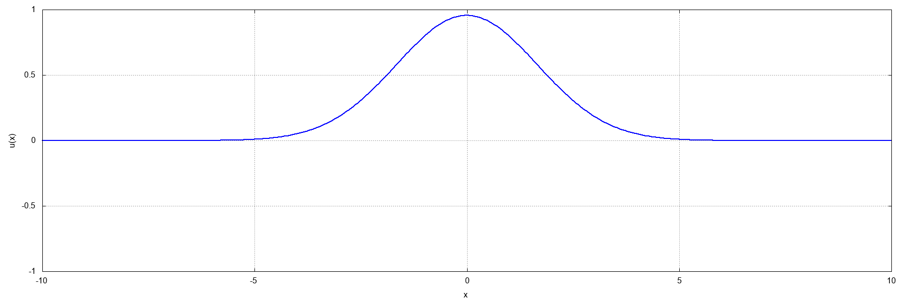
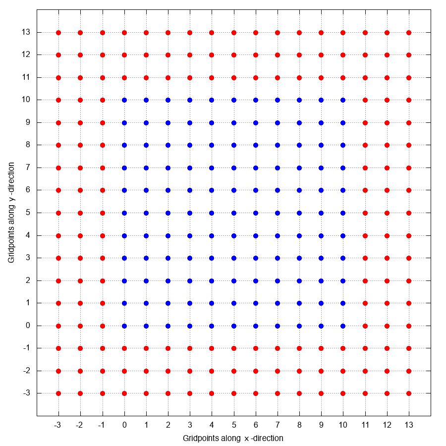

# Table of Contents

* [**Outer boundary conditions**](#BdryCond)
  * [*Inner vs outer boundary conditions*](#BdryCond_Inner_vs_Outer)
  * [*Common outer boundary conditions*](#BdryCond_Common)
    * [Dirichlet boundary conditions](#BdryCond_Dirichlet)
    * [Neumann boundary conditions](#BdryCond_Neumann)
    * [Robin boundary conditions](#BdryCond_Robin)
  * [*A less common boundary condition*](#BdryCond_Outgoing)
  * [*Implementation*](#BdryCond_Implementation)

# Outer boundary conditions \[Back to [ToC](#ToC)\]

Applying outer boundary conditions is a necessary task when solving [partial differential equations](https://en.wikipedia.org/wiki/Partial_differential_equation) (PDEs). In scenarios of physical interest, we generally consider PDEs that evolve a certain quantity in time and space. When solving PDEs on the computer, we must inevitably focus our attention to a finite region of space, which we denote *the computational domain*.

Outer boundary conditions reflect the fact that we must restrict our attention to a finite region, thus introducing *artificial boundaries* into the problem. A wave propagating along the $$x$$-direction will do so forever, but if one studies this wave in a finite region of space, say $$x\in[0,L]$$, then the wave will interact with the boundaries at $$x=0$$ and $$x=L$$, causing, for example, undesirable reflections.

The reason why we refer to these boundary conditions as *outer* is the following: we generally consider a numerical grid with $$N+1$$ discretization points. This grid, which is where we are interested in obtaining the solution, is refered to as the ***interior grid***. However, say we are solving the problem:

$$
\partial_{t}f(t,x) = \partial_{x}f(t,x)\ .
$$

If we approximate the spatial derivatives using, say, second-order centered [finite differences](Finite_differences.md), then we would have

$$
\partial_{t}f^{n}_{i} = \frac{f^{n}_{i+1} - f^{n}_{i-1}}{2\Delta x}\ ,
$$

where the notation $$f^{n}_{i} \equiv f\left(t_{0} + n\cdot\Delta t,x_{0}+i\cdot\Delta x\right)$$ and $$\Delta t$$ and $$\Delta x$$ are the step sizes in the $$t$$ and $$x$$-directions respectively. Now, assuming that the computational grid contains $$N_{x}+1$$ spatial discretization points, i.e. $$i=0,\ldots,N_{x}$$, then we run into problems when evaluating

$$
\begin{align}
\partial_{t}f^{n}_{0} &= \frac{f^{n}_{1} - f^{n}_{-1}}{2\Delta x}\ ,\\
\partial_{t}f^{n}_{N_{x}} &= \frac{f^{n}_{N_{x}+1} - f^{n}_{N_{x}-1}}{2\Delta x}\ .
\end{align}
$$

Notice that the values of $$f$$ at the points $$f^{n}_{0}$$ and $$f^{n}_{N_{x}}$$ are legitimate, in the sense that they are part of the *interior* grid. However, evaluation of the right-hand side of the evolution equation of $$f$$ at those points requires that we have information of the function $$f$$ at the points $$f^{n}_{-1}$$ and $$f^{n}_{N_{x}+1}$$, which are ***not*** part of the interior grid.

The points $$i=-1$$ and $$i=N_{x}+1$$ can then be introduced artificially into the problem, so that we are able to use our numerical scheme to evaluate all interior grid points. Since these points do not belong to the interior grid they are refered to as ***exterior (outer) grid points*** or ***ghostzones***. Outer boundary conditions are thus responsible for specifying the behaviour of the function at the ghostzones. The combination of interior and exterior grids form the computational domain.

As a final comment, we note that the number of ghostzones is scheme dependent. For example, a fourth-order centered [finite differences](Finite_differences.md) would lead to the equation

$$
\partial_{t}f^{n}_{i} = \frac{-f^{n}_{i+2} + 8f^{n}_{i+1} - 8f^{n}_{i-1} + f^{n}_{i-2}}{12\Delta x}\ ,
$$

which would then require knowledge of the points $$i=\left\{-2,-1,N_{x}+1,N_{x}+2\right\}$$, in contrast with the second-order scheme that only requires the points $$i=\left\{-1,N_{x}+1\right\}$$. When we have more than one ghostzone at each outer boundary, it is sometimes not clear how to handle the boundary conditions, but we will get to that later.

## Inner vs outer boundary conditions \[Back to [ToC](#ToC)\]

When applying boundary conditions, we must distinguish between *inner* boundary conditions vs *outer* boundary conditions. In short, inner boundary conditions are applied to points that belong to the *interior grid*, while outer boundary conditions are applied to points that belong to the *exterior grid*.

The simplest example of this is found in [polar coordinates](https://en.wikipedia.org/wiki/Polar_coordinate_system). Let a function $$f$$ depend on time and the two polar variables $$\left(\rho,\theta\right)$$, related to the Cartesian variables $$(x,y)$$ via the standard relations

$$
\begin{align}
x &= \rho\cos\theta\ ,\\
y &= \rho\sin\theta\ .
\end{align}
$$

Let us introduce the notation

$$
f\left(t_{0}+n\cdot\Delta t,\rho_{0}+i\cdot\Delta\rho,\theta_{0}+j\cdot\Delta\theta\right) \equiv f^{n}_{i,j}\ .
$$

Then, returning to our previous example of central finite differences, we run intro trouble when evaluating

$$
\begin{align}
\partial_{t}f^{n}_{0,j} &= \frac{f^{n}_{1,j} - f^{n}_{-1,j}}{2\Delta x}\ ,\\
\partial_{t}f^{n}_{N_{\rho},j} &= \frac{f^{n}_{N_{\rho}+1,j} - f^{n}_{N_{\rho}-1,j}}{2\Delta x}\ .
\end{align}
$$

However, in this coordinate system the points $$i=-1$$ *do not belong to the exterior grid*. This is a direct consequence of the fact that, in polar coordinates,

$$
f\left(-\rho,\theta\right) = f\left(\rho,\theta+\pi\right)\ .
$$

Thus, the way to handle the points with $$i=-1$$ is actually to impose *inner boundary conditions*, as described by the last equation. The points with $$i=N_{\rho}+1$$, however, *do belong to the exterior grid*, and therefore must be handled by imposing outer boundary conditions.

## Common outer boundary conditions \[Back to [ToC](#ToC)\]

We will now discuss the three common boundary conditions: [Dirichlet](https://en.wikipedia.org/wiki/Dirichlet_boundary_condition), [Neumann](https://en.wikipedia.org/wiki/Neumann_boundary_condition), and [Robin](https://en.wikipedia.org/wiki/Robin_boundary_condition).

### Dirichlet boundary conditions \[Back to [ToC](#ToC)\]

[Dirichlet boundary conditions](https://en.wikipedia.org/wiki/Dirichlet_boundary_condition) specify *the function itself* at the ghostzones. For example, in 1 spatial dimension, using a *Cartesian grid* (i.e. a numerical grid that assumes Cartesian coordinates), with 1 ghostzone in each outer boundary, we would have

$$
f^{n}_{-1} = \alpha\ ,\ f^{n}_{N_{x}+1} = \beta\ ,
$$

where $$\alpha$$ and $$\beta$$ are constants. If we allow for ghostzones in the other spatial directions as well, e.g. $$j=\left\{-1,N_{y}+1\right\}$$ along the $$y$$-direction and $$k=\left\{-1,N_{z}+1\right\}$$ along the $$z$$-direction, and assuming a single condition $$\left(f^{n}_{i,j,k}\right)_{\rm ghostzone} = \alpha$$, we would need to impose the following conditions:

|    $$i$$    |    $$j$$    |    $$k$$    | $$f^{n}_{i,j,k}$$ |
|:---------:|:---------:|:---------:|:---------------:|
|    $$-1$$   |    All    |    All    |    $$\alpha$$     |
| $$N_{x}+1$$ |    All    |    All    |    $$\alpha$$     |
|    All    |    $$-1$$   |    All    |    $$\alpha$$     |
|    All    | $$N_{y}+1$$ |    All    |    $$\alpha$$     |
|    All    |    All    |    $$-1$$   |    $$\alpha$$     |
|    All    |    All    | $$N_{z}+1$$ |    $$\alpha$$     |

Dirichlet boundary conditions do not completely populate the ghostzones when the number of ghostzones in each outer boundary is greater than one. The reason for this is that we usually wish to impose Dirichlet boundary conditions at the outermost point of the computational grid, not at every ghostzone point. Returning to one spatial dimension example, if we have $$3$$ ghostzones in each boundary, we would have the following:

|    $$i$$    | $$f^{n}_{i}$$ |
|:---------:|:-----------:|
|   $$-3$$    |  $$\alpha$$   |
|   $$-2$$    |  $$  ??  $$   |
|   $$-1$$    |  $$  ??  $$   |
| $$N_{x}+1$$ |  $$  ??  $$   |
| $$N_{x}+2$$ |  $$  ??  $$   |
| $$N_{x}+3$$ |  $$\alpha$$   |

Handling the other ghostzones would require additional work, either by resorting to [interpolating](https://en.wikipedia.org/wiki/Interpolation) or [extrapolating](https://en.wikipedia.org/wiki/Extrapolation) the function at those points or by adjusting the integration scheme to use, for example, [backwards or forwards finite differences](Finite_differences.md).

A visualization of ***vanishing Dirichlet boundary conditions*** for the wave equation is given in [Figure 1](#Figure1_Dirichlet) below.

<html>
    <figure>
        
        <figcaption>
            <strong>Figure 1</strong>: Solution of the wave equation with vanishing Dirichlet boundary conditions $u(t,x)=0$ at the outer boundaries of the computational domain. These results are from the <code>Wave3D</code> code.
        </figcaption>
    </figure>
</html>

### Neumann boundary conditions \[Back to [ToC](#ToC)\]

[Neumann boundary conditions](https://en.wikipedia.org/wiki/Neumann_boundary_condition) specify the *derivative* of the function at the ghostzones, e.g.

$$
\partial_{n}f = \alpha\ ,
$$

with $$\alpha$$ a constant and $$\partial_{n}$$ indicate the derivative along the direction which is normal to the boundary. Imposing this condition when more ghostzones are present is relatively straightforward as well, though one must sometimes switch to using [centered/backwards/forwards finite differences](Finite_differences.md). For example, consider the differential equation

$$
\partial_{t}f = -v\partial_{x}f\ ,
$$

where $$v$$ is a positive constant.

A visualization of ***vanishing Neumann boundary conditions*** for the wave equation is given in [Figure 2](#Figure2_Neumann) below. Compare the result with the one obtained using vanishing Dirichlet boundary conditions, as given by [Figure 1](#Figure1_Dirichlet).

<html>
    <figure>
        
        <figcaption>
            <strong>Figure 2</strong>: Solution of the wave equation with vanishing Neumann boundary conditions $\partial_{x}u(t,x)=0$ at the outer boundaries of the computational domain. These results are from the <code>Wave3D</code> code.
        </figcaption>
    </figure>
</html>

### Robin boundary conditions \[Back to [ToC](#ToC)\]

[Robin boundary conditions](https://en.wikipedia.org/wiki/Robin_boundary_condition) specify a comobination of the *function* and its *derivative*, at the ghostzones, e.g.

$$
\alpha f + \beta \partial_{n}f = \gamma\ ,
$$

with $$\alpha$$, $$\beta$$, and $$\gamma$$ constants and $$\partial_{n}$$ indicate the derivative along the direction which is normal to the boundary. Imposing this condition when more ghostzones are present is relatively straightforward as well, though one must sometimes switch to using [centered/backwards/forwards finite differences](Finite_differences.md).

A common use of Robin boundary conditions is when we know the asymptotic behaviour of the function at the outer boundary. For example, assume that we know that $$f(r)\sim\frac{1}{r}$$ at the outer boundary $$r=R_{\rm outer}$$. Then, it must be true that

$$
\left.\partial_{r}\left[rf(r)\right]\right|_{r=R_{\rm outer}} = 0\ .
$$

This is the Robin boundary condition

$$
f\left(R_{\rm outer}\right) + R_{\rm outer}\left.\partial_{r}f\right|_{R_{\rm outer}} = 0\ ,
$$

with $$\alpha=1$$, $$\beta = R_{\rm outer}$$, and $$\gamma=0$$. Here, the direction normal to the outer boundary is the $$r$$-direction.

## A less common boundary condition \[Back to [ToC](#ToC)\]

We will now give a less common boundary condition which we will refer to as *outgoing wave boundary condition*. A general solution to the wave equation with 1 spatial dimension,

$$
\partial_{t}^{2}u(t,x) = \partial_{x}^{2}u(t,x)\ ,
$$

where we have chosen the wave speed to be unity, is

$$
u(t,x) = F(t-x) + G(t+x)\ ,
$$

with $$F(t-x)$$ representing a wave moving towards the right (towards the positive $$x$$-direction) and $$G(t,x)$$ representing a wave moving towards the left (towards the negative $$x$$-direction) boundary of the computational domain.

Outgoing wave boundary conditions is the imposition that a wave traveling in a given direction keep traveling in that direction. In other words, we want the wave to *not* interact with the boundaries of the computatinal domain.

This is a fairly straightfoward boundary condition to impose. For example, consider the boundary of computational domain located at $$x=x_{\rm max}$$. When the wave reaches that boundary, it will be propagating towards the right and we intend to keep it that way. Therefore, we wish to impose that

$$
\left.G(t+x)\right|_{x=x_{\rm max}} = 0\ .
$$

Moreover, we wish this condition to be valid for all times $$t$$. Consider then the following quantities

$$
\begin{align}
\partial_{t}u &= \partial_{t}F + \partial_{t}G = +F^{\prime} +G^{\prime}\ ,\\
\partial_{x}u &= \partial_{x}F + \partial_{x}G = -F^{\prime} +G^{\prime}\ ,
\end{align}
$$

where a prime indicates a derivative with respect to the argument. Adding up the two equations result in the equation that will allow us to impose the outgoing wave boundary condition *at the boundary located at* $$x=x_{\rm max}$$,

$$
\left.\left[\partial_{t}u + \partial_{x}u\right]\right|_{x=x_{\rm max}} = 2\left.G^{\prime}\right|_{x=x_{\rm max}} = 0\ ,
$$

where we have set the right-hand side to zero by demanding that $$G=0=\left.G^{\prime}\right\|_{x=x_{\rm max}}$$. Analogously, the outgoing wave boundary condition at $$x=-x_{\\rm max}$$ is obtained through the expression

$$
\left.\left[\partial_{t}u - \partial_{x}u\right]\right|_{x=-x_{\rm max}} = 2\left.F^{\prime}\right|_{x=x_{\rm max}} = 0\ ,
$$

which amounts to imposing that a wave propagating towards the left direction continues that way. Converting the two conditions above to index notation, we see that

$$
\begin{alignat*}{2}
x = + x_{\rm max} &\to \partial_{t}u^{n}_{N_{x}+1}  &&= - \partial_{x}u^{n}_{N_{x}+1}\ ,\\
x = - x_{\rm max} &\to \partial_{t}u^{n}_{0}  &&= + \partial_{x}u^{n}_{0}\ .
\end{alignat*}
$$

Now we need to think about how we are going to evaluate the derivatives at $$i=0$$ and $$i=N_{x}+1$$. Clearly using centered finit differences is not an option, since that would introduce the necessity for extra ghostzones. Instead, we will use backwards and forwards finite differences. Remember that, to second order accuracy in the step size $$\Delta x$$ we have

$$
\begin{align}
\partial_{x}u^{n}_{i} &= \frac{-3u^{n}_{i}+4u^{n}_{i+1}-u^{n}_{i+2}}{2\Delta x}\ ,\\
\partial_{x}u^{n}_{i} &= \frac{3u^{n}_{i}-4u^{n}_{i-1}+u^{n}_{i-2}}{2\Delta x}\ ,
\end{align}
$$

for the forward and backwards finite difference approximations to the first derivative of $$u$$ with respect to $$x$$, respecitvely. Thus, the boundary conditions we wish to impose are (using centered finite differences for the time derivative)

$$
\begin{alignat*}{7}
x = + x_{\rm max} &\to u^{n+1}_{N_{x}+1} &&= u^{n-1}_{N_{x}+1} &&- \frac{\Delta t}{\Delta x}\big(&&+3u^{n}_{N_{x}+1}&&-4u^{n}_{N_{x}}&&+u^{n}_{N_{x}-1}&&\big)\ ,\\
x = - x_{\rm max} &\to u^{n+1}_{0} &&= u^{n-1}_{0} &&- \frac{\Delta t}{\Delta x}\big(&&+3u^{n}_{0}&&-4u^{n}_{1}&&+u^{n}_{2}&&\big)\ .
\end{alignat*}
$$

A visualization of ***outgoing wave boundary conditions*** for the wave equation is given in [Figure 3](#Figure2_Neumann) below. Compare the result with [Figure 1](#Figure1_Dirichlet) and [Figure 2](#Figure1_Neumann).

<html>
    <figure>
        
        <figcaption>
            <strong>Figure 3</strong>: Solution of the wave equation with outgoing wave boundary conditions. These results are from the <code>Wave3D</code> code.
        </figcaption>
    </figure>
</html>

## Implementation \[Back to [ToC](#ToC)\]

The boundary condition algorithm can be summarized quite generally by the following pseudocode:

<pre>
<strong>start LOOP</strong> over <strong>GHOSTZONES</strong>
    <strong>start LOOP</strong> over <strong>GRIDFUNCTIONS</strong>
        Update face of <strong>negative x</strong>; decrease <strong>xmin</strong>;
        Update face of <strong>positive x</strong>; increase <strong>xmax</strong>;
        <strong>IF</strong> DIM>1:
          Update face of <strong>negative y</strong>; decrease <strong>ymin</strong>;
          Update face of <strong>positive y</strong>; increase <strong>ymax</strong>;
          <strong>IF</strong> DIM>2:
            Update face of <strong>negative z</strong>; decrease <strong>zmin</strong>;
              Update face of <strong>positive z</strong>; increase <strong>zmax</strong>;
    <strong>end LOOP</strong> over <strong>GRIDFUNCTIONS</strong>
<strong>end LOOP</strong> over <strong>GHOSTZONES</strong>
</pre>

A visualization of the algorithm for 2 spatial dimensions is shown in [Figure 4](#Figure4_Algorithm) below.

<html>
  <figure>
    
    <figcaption>
        <strong>Figure 4</strong>: General boundary condition algorithm. The <strong>blue</strong> points represent the <strong>interior grid</strong>, while the <strong>red</strong> points indicate the <strong>exterior grid</strong> (prior to the application of boundary conditions). After the <strong>boundary condition</strong> has been applied, the exterior grid point turns <strong>green</strong>, indicating that it has been updated.
    </figcaption>
  </figure>
</html>

### \[Back to [ToC](#ToC)\]
