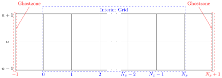

# Table of Contents

* [**The Wave Equation**](#WaveEquation)
  * [*Solving the wave equation in 1-dimensional Cartesian coordinates using finite differences*](#WaveEq)
    * [The evolution equations](#WaveEq_Evolution_Equations)
    * [The initial data problem](#WaveEq_Initial_Data)
    * [Outer boundary conditions](#WaveEq_Outer_Boundary)
    * [Outline of the algorithm](#WaveEq_Algorithm)

# The Wave Equation \[Back to [ToC](#ToC)\]

Here we will explore the [wave equation](https://en.wikipedia.org/wiki/Wave_equation){:target="_blank"} and discuss how to solve it in the computer. For the sake of this discussion, we will be using the [C programming language](https://en.wikipedia.org/wiki/C_(programming_language)){:target="_blank"}.

For a given function $u(t,\vec{x})$, where $\vec{x}=(x,y,z)$, the *wave equation* is given by

$$
\partial_{t}^{2}u(t,\vec{x}) = c^{2}\nabla^{2}u(t,\vec{x})\ ,
$$

where $\nabla^{2}$ is the Laplacian operator, which in Cartesian coordinates reads

$$
\nabla^{2} = \partial_{x}^{2} + \partial_{y}^{2} + \partial_{z}^{2}\ .
$$

Above we have used the fairly standard notation:

$$
\partial_{t} \equiv \frac{\partial}{\partial t}\ ,\quad \partial_{t}^{2} \equiv \frac{\partial}{\partial t^{2}}\ , \quad \text{etc}\ .
$$

## Solving the wave equation in 1-dimensional Cartesian coordinates using finite differences \[Back to [ToC](#ToC)\]

We will start studying the wave equation by focusing on the simplest case, the 1D wave equation. Considering that the one spatial dimension is the $x$-direction, we have

$$
\partial_{t}^{2}u(t,x) = c^{2}\partial_{x}^{2}u(t,x)\ .
$$

A standard technique when dealing with an equation like this is to define a new auxiliary function

$$
v(t,x) \equiv \partial_{t}u(t,x)\ ,
$$

so that we trade one second-order differential equation by a system of coupled, first-order differential equations:

$$
\begin{align}
\partial_{t}u(t,x) &= v(t,x)\ ,\\
\partial_{t}v(t,x) &= c^{2}\partial_{x}^{2}u(t,x)\ .
\end{align}
$$

One could also simplify the Laplacian operator by introducing yet another auxiliary function $w_{x}(t,x)\equiv\partial_{x}u(t,x)$, but we won't do that here.

### The evolution equations \[Back to [ToC](#ToC)\]

We will use second-order, centered [finite differences](Finite_differences.md){:target="_blank"} to solve this problem. Introducing the notation

$$
f\left(n\cdot\Delta t,i\cdot\Delta x\right) \equiv f^{n}_{i}\ ,
$$

we have thus the approximations

$$
\begin{align}
\partial_{t}f^{n}_{i}     &= \frac{f^{n+1}_{i}-f^{n-1}_{i}}{2\Delta t}           \ ,\\
\partial_{x}f^{n}_{i}     &= \frac{f^{n}_{i+1}-f^{n}_{i-1}}{2\Delta x}           \ ,\\
\partial_{x}^{2}f^{n}_{i} &= \frac{f^{n}_{i+1}-2f^{n}_{i}+f^{n}_{i-1}}{\Delta x^{2}}\ ,
\end{align}
$$

which allow us to write down the wave equation as

$$
\begin{align}
\frac{u^{n+1}_{i}-u^{n-1}_{i}}{2\Delta t} &= v^{n}_{i}\ ,\\
\frac{v^{n+1}_{i}-v^{n-1}_{i}}{2\Delta t} &= c^{2}\frac{u^{n}_{i+1}-2u^{n}_{i}+u^{n}_{i-1}}{\Delta x^{2}}\ ,
\end{align}
$$

leading to the iterative relations

$$
\boxed{
\begin{align}
u^{n+1}_{i} &= u^{n-1}_{i} + 2\Delta t v^{n}_{i}\\
v^{n+1}_{i} &= v^{n-1}_{i} + \frac{2c^{2}\Delta t}{\Delta x^{2}}\left(u^{n}_{i+1}-2u^{n}_{i}+u^{n}_{i-1}\right)
\end{align}
}\ .
$$

### The initial data problem  \[Back to [ToC](#ToC)\]

As can be seen from the boxed equation above, this is a scheme that involves *three time levels*, since the left-hand sides (LHS) are terms that depend on the time level $n+1$, while the right-hand sides (RHS) contain terms on the time levels $n-1$ and $n$.

The wave equation is a second-order differential equation, so it is indeed expected that we provide *two* initial conditions in order to specify a solution. Say we wish to specify the initial conditions $u(0,x) = f(x)$ and $\partial_{t}u(0,x) = v(0,x) = 0$. These are easily implemented using

$$
\begin{align}
u_{i}^{0} &= f(x)\ ,\\
v_{i}^{0} &= 0\ .
\end{align}
$$

This is all very well, but now how do we evolve the system in time? We currently have access to $\left(u^{0}\_{i},v^{0}\_{i}\right)$, but if we use our evolution equations with $n=1$, we will need to have access to $\left(u^{1}\_{i},v^{1}\_{i}\right)$ *before* we can compute $\left(u^{2}\_{i},v^{2}\_{i}\right)$. Obtaining $\left(u^{1}\_{i},v^{1}\_{i}\right)$ then becomes a crucial part of the initial data specification known as the ***initial data problem***.

To make it clear, when the user specify $\left(u^{0}\_{i},v^{0}\_{i}\right)$ we are giving the *initial conditions* required by the differential equation. However, due to our choice of numerical scheme, a different, *artificial* initial condition is also required, that is $\left(u^{1}\_{i},v^{1}\_{i}\right)$. The combination of these two initial conditions is referred to as the *initial data*.

A common trick to obtain this initial data is the following. Consider a *half-step forward* iteration

$$
\begin{align}
\partial_{t}u^{n+\frac{1}{2}}_{i} &= \frac{u^{n+\frac{1}{2}}_{i} - u^{n}_{i}}{\Delta t/2} = v^{n}_{i}\ ,\\
\partial_{t}v^{n+\frac{1}{2}}_{i} &= \frac{v^{n+\frac{1}{2}}_{i} - v^{n}_{i}}{\Delta t/2} = \frac{c^{2}}{\Delta x^{2}}\left(u^{n}_{i+1}-2u^{n}_{i}+u^{n}_{i-1}\right)\ ,
\end{align}
$$

followed by a *half-step* centered iteration

$$
\begin{align}
\partial_{t}u^{n+\frac{1}{2}}_{i} &= \frac{u^{n+1}_{i} - u^{n}_{i}}{\Delta t} = v^{n+\frac{1}{2}}_{i}\ ,\\
\partial_{t}v^{n+\frac{1}{2}}_{i} &= \frac{v^{n+1}_{i} - v^{n}_{i}}{\Delta t} = \frac{c^{2}}{\Delta x^{2}}\left(u^{n+\frac{1}{2}}_{i+1}-2u^{n+\frac{1}{2}}_{i}+u^{n+\frac{1}{2}}_{i-1}\right)\ .
\end{align}
$$

Noticed that these derivatives are centered at the $n+\frac{1}{2}$ point, as opposed to the usual $n$. Thus, to obtain initial data we use the following algorithm (assuming $n=0$ corresponds to the initial data level)

$$
\boxed{
\begin{align}
u_{i}^{0} &= f(x)\\
v_{i}^{0} &= 0\\
u^{\frac{1}{2}}_{i} &= u^{0}_{i} + \frac{\Delta t}{2}v^{0}_{i}\\
v^{\frac{1}{2}}_{i} &= v^{0}_{i} + \frac{c^{2}\Delta t}{2\Delta x^{2}}\left(u^{0}_{i+1}-2u^{0}_{i}+u^{0}_{i-1}\right)\\
u^{1}_{i} &= u^{0}_{i} + \Delta t v^{\frac{1}{2}}_{i}\\
v^{1}_{i} &= v^{0}_{i} + \frac{c^{2}\Delta t}{\Delta x^{2}}\left(u^{\frac{1}{2}}_{i+1}-2u^{\frac{1}{2}}_{i}+u^{\frac{1}{2}}_{i-1}\right)
\end{align}
}\ .
$$

### Outer boundary conditions  \[Back to [ToC](#ToC)\]

The wave equation is defined everywhere, that is $-\infty<x,y,z<\infty$. However, when solving the problem numerically, we must restrict our attention to a finite domain, which in turn introduces the necessity of imposing *outer boundary conditions*.

Outer boundary conditions specify the behaviour of the functions $u(t,x)$ and $v(t,x)$ at the spatial boundaries of the computational domain. To see why we need this, notice that the spatial derivatives with respect to $x$ require us to know the function $u$ at the points $\left(u_{i-1}^{n},u_{i}^{n},u_{i+1}^{n}\right)$. However, if we have $N_{x}+1$ points along the $x$-direction discretization, i.e. $i=0,1,\dots,N_{x}$, then we cannot evaluate the following quantities:

$$
\begin{align}
\partial_{x}^{2}u^{n}_{0} &= \frac{u^{n}_{1} - 2u^{n}_{0} + u^{n}_{-1}}{\Delta x^{2}}\ ,\\
\partial_{x}^{2}u^{n}_{N_{x}} &= \frac{u^{n}_{N_{x}+1} - 2u^{n}_{N_{x}} + u^{n}_{N_{x}-1}}{\Delta x^{2}}\ ,
\end{align}
$$

since we do not have the values $u^{n}\_{-1}$ and $u^{n}\_{N_{x}+1}$.

In order to be able to use our numerical scheme throughout the entire numerical grid, we introduce *artificially* the points $i=-1$ and $i=N_{x}+1$ to the grid. The portion of the numerical grid which contains *only* the points $i=0,1,\dots,N_{x}$ is referred to as the ***interior grid***, while the points $i=-1$ and $i=N_{x}+1$ are referred to as ***external grid points***  or ***ghostzones***. [Figure 1](#Figure1) illustrates the numerical grid.

<html>
    <figure>
        
        <figcaption>
            <strong>Figure 1</strong>: Illustration of computational grid. The interior grid is composed of the blue spatial points and the ghostzones are composed of the red spatial points. The illustration also shows the three time levels required by the numerical scheme described here.
        </figcaption>
    </figure>
</html>

The number of ghostzones is scheme dependent. For example, choosing to evaluate the spatial derivative $\partial_{x}u(t,x)$ using $\mathcal{O}\left(\Delta x^{2}\right)$ centered finite differences only requires $1$ ghostzone at each boundary of the computational domain. On the other hand, a scheme evaluating $\partial_{x}u(t,x)$ using $\mathcal{O}\left(\Delta x^{4}\right)$ centered finite differences would required $2$ ghostzones at each boundary, and one using $\mathcal{O}\left(\Delta x^{6}\right)$ centered finite differences would required $3$.

The idea behind ghostzones is to be able to naturally evaluate all points that belong to the interior grid, without modifying our scheme. Then, after all interior grid points have been determined, we apply outer boundary conditions to the ghostzones, filling up the entire grid before moving on to the next time step.

Since our numerical scheme of choice only requires one ghostzone at each outer boundary, we will choose to impose [Dirichlet boundary conditions](https://en.wikipedia.org/wiki/Dirichlet_boundary_condition){:target="_blank"} of the form

$$
\boxed{
\begin{align}
u^{n}_{-1} &= 0 = u^{n}_{N_{x}+1}\\
v^{n}_{-1} &= 0 = v^{n}_{N_{x}+1}
\end{align}
}\ .
$$

### Outline of the algorithm  \[Back to [ToC](#ToC)\]

We now outline the numerical algorithm we will use to solve the wave equation. It is a combination of all the equations we have boxed this far:

<ol>
    <li>
Set the initial condition

$$
\boxed{u^{0}_{i} = f(x)\ ,\ v^{0}_{i} = 0 }\ ,
$$

where $f(x)$ is a function of our choosing. This initial condition is applied <em>to the interior grid</em>.
    </li>

    <li>
Set boundary conditions to the initial condition

$$
\boxed{u^{0}_{-1} = u^{0}_{N_{x}+1} = v^{0}_{-1} = v^{0}_{N_{x}+1} = 0}\ .
$$
    </li>

    <li>
Find the initial data.
        <ol>
            <li>
    Start by computing the "half-step forward" approximation

$$
\boxed{
\begin{align}
u^{\frac{1}{2}}_{i} &= u^{0}_{i} + \frac{\Delta t}{2}v^{0}_{i}\\
v^{\frac{1}{2}}_{i} &= v^{0}_{i} + \frac{c^{2}\Delta t}{2\Delta x^{2}}\left(u^{0}_{i+1}-2u^{0}_{i}+u^{0}_{i-1}\right)
\end{align}
}\ .
$$
            </li>
            <li>
    Next, apply boundary conditions

$$
\boxed{u^{\frac{1}{2}}_{-1} = u^{\frac{1}{2}}_{N_{x}+1} = v^{\frac{1}{2}}_{-1} = v^{\frac{1}{2}}_{N_{x}+1} = 0}\ .
$$
            </li>
            <li>
    Then, compute the "half-step centered" approximation

$$
\boxed{
\begin{align}
u^{1}_{i} &= u^{0}_{i} + \Delta t v^{\frac{1}{2}}_{i}\\
v^{1}_{i} &= v^{0}_{i} + \frac{c^{2}\Delta t}{\Delta x^{2}}\left(u^{\frac{1}{2}}_{i+1}-2u^{\frac{1}{2}}_{i}+u^{\frac{1}{2}}_{i-1}\right)
\end{align}
}\ .
$$
            </li>
            <li>
    Finally, apply boundary conditions

$$
\boxed{u^{1}_{-1} = u^{1}_{N_{x}+1} = v^{1}_{-1} = v^{1}_{N_{x}+1} = 0}\ .
$$
            </li>
        </ol>
    </li>

    <li>
Start the main time loop. While $n$ < $N_{t}^{\rm max}$, do:
    </li>
    <ol>
        <li>
    Step the interior grid forward in time using our $\mathcal{O}\left(\Delta t^{2} + \Delta x^{2}\right)$ centered finite differences scheme, namely

$$
\boxed{
\begin{align}
u^{n+1}_{i} &= u^{n-1}_{i} + 2\Delta t v^{n}_{i}\\
v^{n+1}_{i} &= v^{n-1}_{i} + \frac{2c^{2}\Delta t}{\Delta x^{2}}\left(u^{n}_{i+1}-2u^{n}_{i}+u^{n}_{i-1}\right)
\end{align}
}\ .
$$
        </li>
        <li>
Apply boundary conditions

$$
\boxed{u^{n+1}_{-1} = u^{n+1}_{N_{x}+1} = v^{n+1}_{-1} = v^{n+1}_{N_{x}+1} = 0}\ .
$$
        </li>
    </ol>
</ol>

### \[Back to [ToC](#ToC)\]
